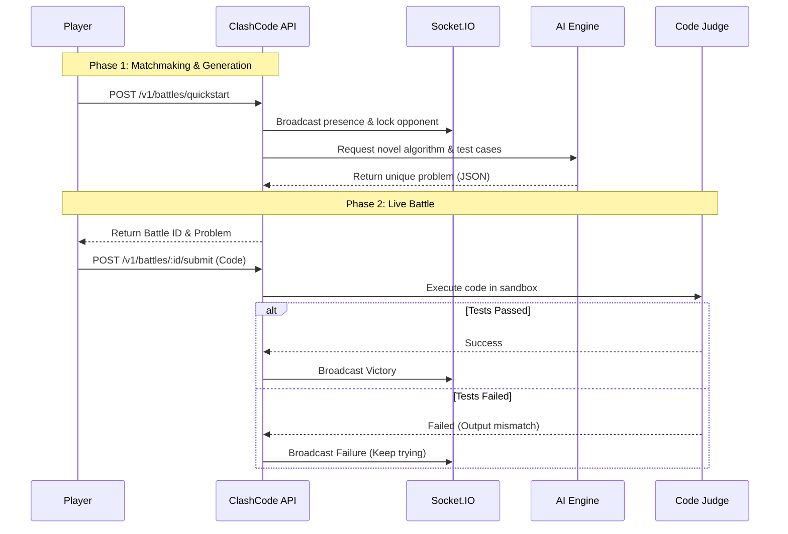

<div align="center">
  <h1>⚔️ ClashCode</h1>
  <p><strong>1v1 Live Coding Battles for Colleges</strong></p>

  <p>
    <a href="https://github.com/PraveenNPatil07/ClashCode/actions"></a>
    <a href="https://opensource.org/licenses/MIT"></a>
    
  </p>
</div>

Instead of students grinding algorithms in isolation, ClashCode transforms coding into a high-stakes, real-time esport. Represent your college, challenge rivals to live 1v1 battles, and solve AI-generated algorithms faster than your opponent to climb the global leaderboard.

---

## 📖 Table of Contents
- [The Problem](#the-problem)
- [The Solution](#the-solution)
- [Architecture & Data Flow](#architecture--data-flow)
- [Core Features & Guarantees](#core-features--guarantees)
- [Endpoints](#endpoints)
- [Technology Stack](#technology-stack)
- [How We Used Codex & GPT-5.6](#how-we-used-codex--gpt-56)
- [Local Development](#local-development)
- [Production Deployment](#production-deployment-render--supabase)
- [Known Limitations](#known-limitations-hackathon-scope)

---

## 🚨 The Problem

Current coding platforms (like LeetCode or HackerRank) are solitary experiences. Students grind algorithms in isolation without the thrill of real-time competition or school pride. Furthermore, traditional hackathons and algorithmic competitions rely on static, pre-written problem sets. This creates two issues: 
1. Problems are easily Googled, encouraging cheating.
2. Creating fresh, balanced algorithmic problems with robust test cases is incredibly time-consuming for organizers.

## 💡 The Solution

ClashCode acts as a real-time arena that completely gamifies algorithmic problem-solving.

1. **Matchmaking:** Students are instantly paired with opponents from rival colleges (or an AI bot if the queue is empty).
2. **Infinite Novelty:** ClashCode utilizes AI to generate completely unique, novel coding problems and deterministic test cases on the fly.
3. **Execution & Victory:** Both players share a live timer and submit their code to a hidden judge. The first player to pass all test cases instantly wins, earning points for their college.

---

## 🏗 Architecture & Data Flow



---

## 🛡 Core Features & Guarantees

- **Real-Time Synchronization:** Powered by Socket.IO, ensuring sub-second state updates across all connected clients during live 1v1 battles. When an opponent submits code, you see it instantly.
- **Infinite Problem Generation:** Leveraging LLMs (OpenAI) to synthetically generate infinite algorithmic problems, edge cases, and deterministic I/O test cases on-demand.
- **Safe Execution Sandbox:** User-submitted code (Python, JS, Java, C++) is isolated and executed in a secure environment to prevent malicious system access while providing accurate execution times.
- **AI Sparring Partner:** If no human opponents are available, players can instantly spin up an AI bot opponent that solves the problem at a simulated human pace, ensuring there is always a match ready.
- **College Leaderboards:** A global PostgreSQL-backed leaderboard aggregating points across all college members, fostering school pride and rivalry.
- **Post-Match AI Debriefs:** After a battle concludes, players receive personalized, AI-generated code reviews highlighting optimization opportunities (Big O time/space complexity) for their specific solution.

---

## 🔌 Endpoints

- `POST /api/battles/quickstart`: Enter the matchmaking queue and find an opponent or spawn an AI.
- `POST /api/battles/:id/submit`: Submit code for execution against hidden test cases.
- `POST /api/problems/generate`: Generate a completely novel algorithmic problem via AI.
- `GET /api/leaderboard/colleges`: Fetch the aggregated college rankings.
- `GET /api/users/:id/dashboard`: Retrieve a user's match history, win rate, and recent battles.

---

## 💻 Technology Stack

- **Frontend**: React (Vite) + TypeScript + TailwindCSS
- **Backend API Layer**: Node.js + Express + TypeScript
- **Real-Time**: Socket.IO
- **Database**: PostgreSQL (via Supabase)
- **AI Engine**: OpenAI API (for problem generation & debriefs)
- **Testing**: Playwright (E2E) + Vitest (Unit)
- **Package Manager**: npm workspaces (Monorepo setup)

---

## 🧠 How We Used Codex & GPT-5.6

**Where Codex Accelerated Our Workflow:**
Codex acted as a highly capable pair-programmer throughout the entire development lifecycle, drastically accelerating our velocity. Key areas where Codex was instrumental included:
1. **Real-Time Infrastructure:** Codex architected the complex `Socket.io` event synchronization, handling matchmaking, presence tracking, and real-time battle state across clients seamlessly.
2. **Full-Stack Scaffolding & Refactoring:** Codex rapidly scaffolded the Node.js/Express backend and Vite frontend. When we ran into complex TypeScript generic constraints and type-mismatches between our shared data models, Codex instantly identified and resolved them across the monorepo.
3. **Last-Minute Feature Shipping:** Right before submission, we realized the core "College War" declaration UI was missing. Codex immediately mapped out the missing UI components, added the "Declare War" functionality to our Leaderboard, and perfectly hooked it into the existing backend routes without breaking the build. 

**How GPT-5.6 Powers the Core Experience:**
GPT-5.6 is the beating heart of ClashCode's infinite replayability. We heavily integrated GPT-5.6 to solve two major problems in competitive programming:
1. **Zero-Cheating Problem Generation:** Instead of pulling from a static database of known problems, our backend queries GPT-5.6 to synthesize completely novel algorithmic challenges on the fly. It strictly outputs structured JSON containing the problem description, constraints, and perfectly deterministic edge-case test inputs/outputs for our sandbox judge to evaluate.
2. **Personalized Mentorship (Debriefs):** After a battle, we feed the user's submitted code directly into GPT-5.6. It acts as a senior engineer, analyzing their specific implementation and providing a detailed breakdown of their Big O time/space complexity, alongside actionable refactoring advice.

---

## 🛠 Local Development

Follow these steps to run ClashCode locally.

1. **Install Dependencies**
```bash
npm install
```

2. **Environment Variables**
Set up your `.env` files.

**Backend (`backend/.env`)**:
```bash
SUPABASE_URL=https://your-project.supabase.co
SUPABASE_SERVICE_ROLE_KEY=your-service-role-key
OPENAI_API_KEY=your-openai-key
PORT=4000
CLIENT_ORIGIN=http://localhost:5173
```

**Frontend (`frontend/.env`)**:
```bash
VITE_API_URL=http://localhost:4000/api
VITE_SOCKET_URL=http://localhost:4000
```

3. **Database Migration & Seeding**
Ensure you have Supabase CLI installed, or use your hosted Supabase dashboard to run the migrations.
```bash
# Push the schema to your database
supabase db push
# Seed the database with mock colleges, users, and problems
npm run seed
```

4. **Start the Application**
Start both the backend and frontend development servers.
```bash
npm run dev:backend
npm run dev:frontend
```

### Running the Test Suite

We use Vitest for unit testing and Playwright for End-to-End (E2E) testing.
```bash
npm test
```

---

## 🚀 Production Deployment (Render + Supabase)

ClashCode is configured to easily deploy to managed hosting providers like Render and Supabase.

1. Create a PostgreSQL database on **Supabase** and run the initial migrations located in `backend/supabase/migrations/`.
2. Push your code to GitHub, then in the **Render Dashboard**, connect this repository to a new Web Service.
3. Configure the Root Directory to `backend` and set the build command to `npm install && npm run build`.
4. Render will prompt you for Environment Variables. Paste your Supabase URLs and OpenAI keys.
5. Deploy the frontend to **Vercel** or **Render Static Sites**, pointing the `VITE_API_URL` to your newly deployed backend service.

---

## ⚠️ Known Limitations (Hackathon Scope)

While ClashCode is fully functional, certain compromises were made for the scope of this hackathon:

1. **Sandbox Security**: Currently, the code execution sandbox relies on basic isolation. For a true production environment, a more robust solution like Firecracker microVMs or strict Docker resource limits would be necessary to prevent sandbox escapes.
2. **Matchmaking Scaling**: The matchmaking queue and presence tracking are currently handled in-memory via Socket.IO within a single Node process. Horizontal scaling would require moving this state to a Redis instance and utilizing the `@socket.io/redis-adapter`.
3. **Database Indexing**: Certain leaderboard queries lack optimized indexes (e.g., aggregating points across thousands of users), which could degrade performance at extremely high player volumes.
4. **LLM Hallucinations**: While prompts are strictly engineered for JSON output, the AI problem generator may occasionally produce edge-case test constraints that are computationally impossible to solve within the standard 2-second time limit.
